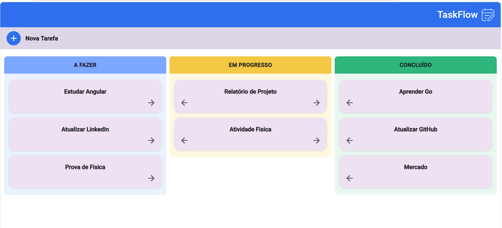

# Task Manager

[](https://go.dev/)
[](https://gin-gonic.com/)
[](https://www.postgresql.org/)
[](https://www.docker.com/)
[](https://angular.dev/)
[](https://www.typescriptlang.org/)
[](https://material.angular.dev/)
[](https://sass-lang.com/)

Sistema de controle de tarefas em formato Kanban, full-stack: API REST em
**Go** (arquitetura em camadas + PostgreSQL, containerizada com Docker) e interface em
**Angular** (standalone components, signals, Angular Material) consumindo essa API.

Projeto de estudo construído do zero — primeiro contato da autora tanto com Go quanto
com Angular — usado aqui como portfólio técnico. As decisões de arquitetura e as
convenções de código priorizam aprender cada stack na prática, não necessariamente a
forma mais enxuta de resolver o problema.



---

## Funcionalidades

- **Board Kanban** com 3 colunas (A fazer / Em progresso / Concluído), cada uma
  buscando as tarefas reais da API
- **CRUD completo de tarefas**: criar (formulário dedicado), visualizar, editar e
  excluir (diálogo modal), tudo persistido no backend
- **Mover tarefas entre colunas** de duas formas: botões de seta no card ou
  **drag-and-drop** (Angular CDK), com feedback visual durante o arraste (sombra no
  card, slot tracejado indicando onde ele vai cair, destaque na coluna de destino)
- **Feedback ao usuário** via snackbar para criar, editar e excluir tarefas
- **Layout responsivo**, do desktop a telas estreitas de celular

---

## Arquitetura geral

```
Angular (localhost:4200)  ──HTTP/JSON──▶  API Go / Gin (localhost:8000)  ──SQL──▶  PostgreSQL (localhost:5432)
     TaskService                          Controller → Service → Repository
                                                 (Docker Compose)
```

O frontend fala com a API só através de `TaskService` (`HttpClient`); a API segue o
padrão em camadas Controller → Service → Repository, isolando o acesso ao banco numa
única camada. Backend e banco rodam em containers Docker; o frontend roda localmente
via `ng serve` durante o desenvolvimento.

---

## Stack

| | Tecnologias |
|---|---|
| **Backend** | Go 1.25 · Gin · lib/pq · PostgreSQL 17 · Docker / Docker Compose |
| **Frontend** | Angular 22 (standalone components, signals) · Angular Material + CDK (Dialog, Snack Bar, Drag & Drop) · Reactive Forms · SCSS · Vitest |

---

## Estrutura do repositório

```
projetoCRUD/
├── backEndGo/          → API REST em Go — ver [README do backend](./backEndGo/README.md)
└── frontEndAngular/     → interface Angular (Kanban) — ver [README do frontend](./frontEndAngular/README.md)
```

Cada subprojeto tem seu próprio README com a arquitetura, decisões técnicas e roadmap
detalhados:

- **[backEndGo/README.md](./backEndGo/README.md)** — camadas Controller/Service/Repository,
  fluxo de uma requisição, modelo de dados, endpoints, CORS
- **[frontEndAngular/README.md](./frontEndAngular/README.md)** — árvore de componentes,
  fluxo de dados do Kanban (criar/editar/excluir/mover), estrutura do projeto

---

## Como rodar o projeto completo

**1. Backend + banco de dados** (Docker e Docker Compose instalados, Docker Desktop
aberto; crie um `.env` em `backEndGo/` a partir de `.env.exemple`):

```bash
cd backEndGo
docker compose up --build -d
```

Confirma que a API subiu:

```bash
curl http://localhost:8000/ping
```

**2. Frontend:**

```bash
cd frontEndAngular
npm install
ng serve
```

Abre em `http://localhost:4200/`.

---

## Roadmap

Os itens pendentes de cada camada estão detalhados nos READMEs de cada subprojeto.
Destaques atuais:

- [ ] Automatizar a criação da tabela `tasks` no Postgres (script de init/migration)
- [ ] Validações de entrada na API (ex: `title` obrigatório)
- [ ] Testes automatizados (backend: service/repository; frontend: `TaskService` com dados mockados)
- [ ] `environment` do Angular com a URL base da API (hoje fixa em `TaskService`)
- [ ] Confirmação antes de excluir uma tarefa

---

## Contexto de aprendizado

Este é o primeiro projeto full-stack da autora construído do zero em ambas as pontas:
a API em Go (arquitetura em camadas, `database/sql` com `lib/pq`, roteamento com Gin)
e a interface em Angular (standalone components, signals, Angular Material e CDK).
Os READMEs de cada subprojeto documentam decisões técnicas específicas tomadas ao
longo do caminho — como a configuração de CORS entre frontend e backend, ou o fluxo de
sincronização do board Kanban com a API.
